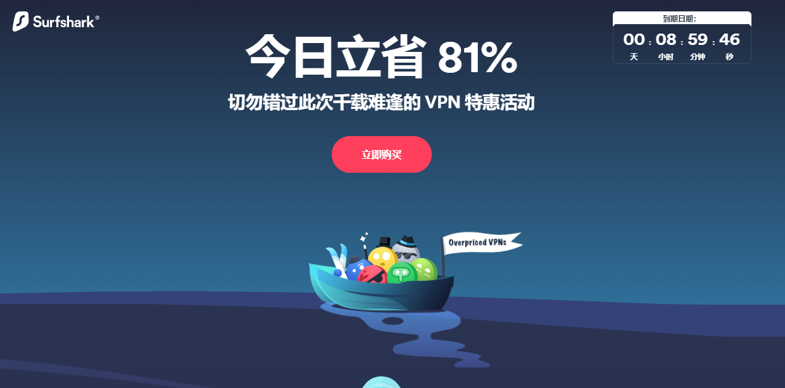

# 免费的ssr翻墙梯子软件工具以及V2ray机场软件

### 免费的ssr梯子翻墙软件对于很多人来说还是第一选择，原因没有别的，因为最早接触翻墙的朋友，刚开始肯定是首先接触的ss以及ssr，曾几何时，小火箭也是被我用的飞起，虽然目前已经转战V2ray的梯子，不过对于ssr还是有种莫名的执念和好感。

如果你喜欢用ssr的翻墙软件工具，这里可以给大家推荐几个:

## Westworld梯子：[点击直达](https://xbsj3462.fun/i/art046)

这个梯子也是有ssr节点的，虽然主推的是V2ray，但是为了照顾到一些用户对于ssr的执着，也是保留了部分ssr的节点。

梯子的用法也比较简单，可以配合小火箭使用，也可以直接下载他们网站上的官方客户端，官方客户端能够自动读取所有的节点列表，只需要登陆账号，选择节点就能够使用，非常方便。

梯子线路很稳定，全部都是IEPL专线线路，能够有效避免高峰时期的网络拥堵，费用也不高，有免费，月费和年费三类线路，月费25，年费188，在ssr的梯子软件当中价格已经算是很划算了，如果结合他们的节点线路质量来看，性价比非常高。

梯子的隐私保密程度也很高，总部位于瑞士，具有良好的信用和背景，不会记录用户使用和浏览的数据，而且注册邮箱可以随意填写，不用验证，不想使用了也可以注销账号。

网速也很快，后台节点分类齐全，有游戏线路（延迟很低），奈飞视频专线以及正常的通用线路，在Youtube上看4k画质的视频依然能够很流畅，不会卡顿，是我目前用下来的梯子当中，感觉最靠谱的一款。

经过几次测速，Youtube的4k清晰度的视频基本能够做到秒开，并且整体的观看过程很流畅，不会卡顿，快进之后的重新加载也基本都是秒加载，对于重度视频用户而言，这款梯子是个不错的选择。

## VyprVpn梯子：[点击直达](vyprvpn.com)

这个梯子是我之前曾经为了测试用过一段时间的ss机场梯子，也有中文界面的支持，总体感觉中规中矩还算不错的。

虽然性价比不是很高，但是作为一款备用梯子而言，在其他梯子都失效的情况下，还是可以保证我们正常的上网情况。

并且这款梯子据传有变色龙翻墙协议（虽然以我这么多年的翻墙经验，也是头一回听说这个协议名字），我看了下就是有数据的混淆加密，不过貌似所有梯子都是有加密的，也许这款梯子在这一点上做的更好吧。

梯子的线路类似还是比较多的，节点丰富，也有自己的客户端可供使用和下载，并且支持流媒体的解锁，但是苹果ios系统的客户端还没有发布，所以如果想在苹果手机上使用梯子的用户，可以不用考虑这款梯子。

经过几次测试，观看视频方面总体来说是比较流畅的，也能保证观看的全过程不卡顿，不掉线。

## SurfShark梯子：[点击直达](SurfShar.com)

这款梯子我之前一直在犹豫要不要推荐，因为我使用下来发现，无论是从客户端的完善性，性价比，节点线路质量，使用体验，网速等等各方面，总有能够吊打它的ssr梯子软件，但是如果把这几个方面都组合在一起来看，这款梯子也能算是发展的比较均衡，就是各方面都做的不是很优秀，但总归是做到了合格的程度。

据说这款梯子的主要用户群体是在国外，当初打听到这个消息的时候我也是黑人问号脸，为啥在国外还需要用到梯子，不过后来才知道，有墙的国家还是挺多的。

就我个人使用下来的经验看，这款梯子的话，也没什么好介绍的，作为备用梯子还是比较合格。

### 这三款ssr梯子软件大家如果感兴趣都可以去试试，选择适合自己的一款[好用的梯子软件](https://github.com/gelangtai/bstVPN)，只有最适合自己的。
